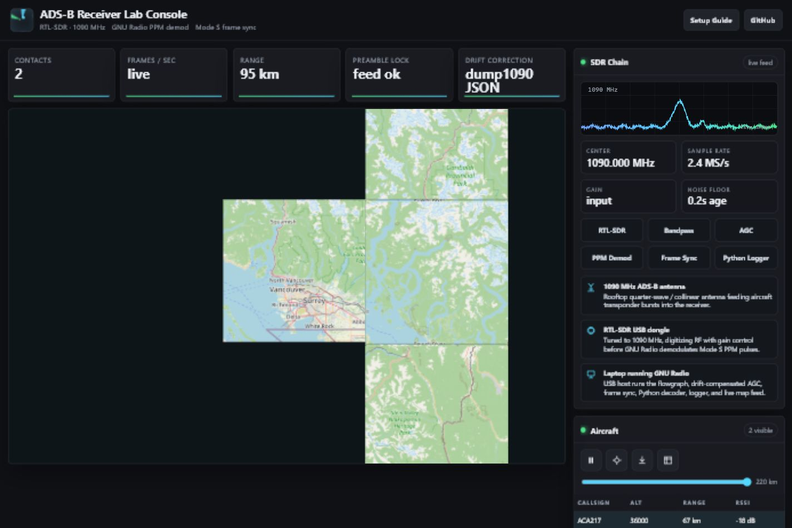

# ADS-B Aircraft Receiver Lab

> Public archive note: this repository is a portfolio/demo-safe version prepared from private working repositories/materials; sensitive details, credentials, raw logs, and proprietary context are intentionally omitted.

Lab console and hookup notes for a software-defined ADS-B receiver built around an RTL-SDR dongle, GNU Radio / dump1090-style decoding, and a Python logger.

The browser dashboard includes a sample view for interface review. Live values appear after the server is connected to decoded ADS-B output from receiver software.

## Hardware Path

- 1090 MHz ADS-B antenna
- Optional 1090 MHz band-pass filter and LNA
- RTL-SDR USB dongle or compatible SDR
- Laptop or Raspberry Pi running the decoder stack
- GNU Radio, `dump1090`, `readsb`, or `gr-air-modes`

## How The Dashboard Gets Values

1. Aircraft transmit Mode S / ADS-B messages on 1090 MHz.
2. The antenna and RTL-SDR receive and digitize the RF signal.
3. GNU Radio or a decoder such as `dump1090` / `readsb` demodulates the Mode S frames.
4. `adsb_live_server.py` reads either `aircraft.json` or SBS/BaseStation TCP output.
5. The dashboard polls `/api/aircraft`, `/api/messages`, and `/api/status`.
6. Decoded frames are archived to CSV under `adsb_logs/`.

Until step 4 is connected, the page shows sample contacts and a "sample mode" state so the interface can be reviewed without a live RF feed.

## Run With dump1090/readsb JSON

```bash
python adsb_live_server.py --port 8770 --aircraft-json /run/readsb/aircraft.json
```

Common alternate paths:

```bash
python adsb_live_server.py --port 8770 --aircraft-json /var/run/dump1090-fa/aircraft.json
python adsb_live_server.py --port 8770 --aircraft-json /usr/share/dump1090-fa/html/data/aircraft.json
```

Open:

```text
http://127.0.0.1:8770/
```

## Run With SBS/BaseStation TCP

If your decoder exposes SBS messages on port 30003:

```bash
python adsb_live_server.py --port 8770 --sbs-host 127.0.0.1 --sbs-port 30003
```

## What The Lab Console Shows



- Receiver/feed status
- Aircraft position markers
- ICAO address, callsign, altitude, range, and signal
- Mode S message log
- CSV/JSON export from the current browser session
- SDR chain and hardware connection notes
- Sample mode when no local receiver API is connected

## Verification Checklist

- `rtl_test -t` detects the SDR dongle
- Decoder service is running
- `aircraft.json` contains an `aircraft` array, or SBS TCP is reachable
- The Python server reports `connected: true` at `/api/status`
- The dashboard changes from waiting/no-feed to live feed

## Screenshot

See `docs/lab-console-sample.png` for a sample run using a local receiver JSON feed.
